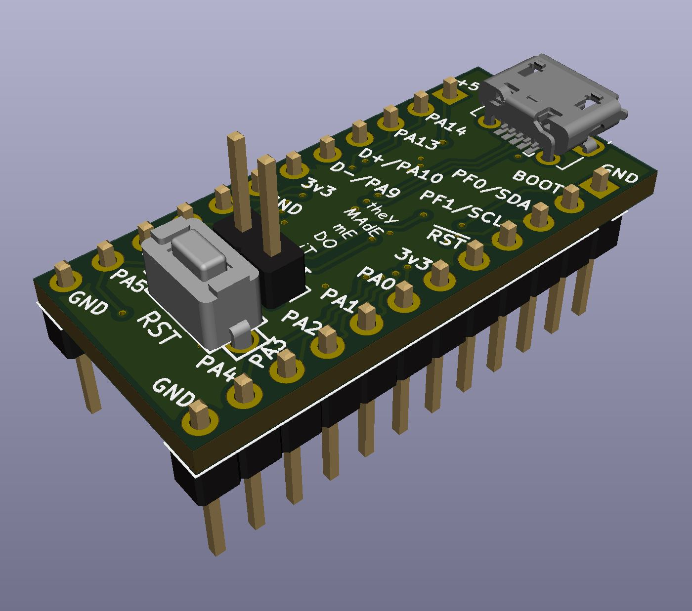

# STM32F042 Breakout #

[Interactive bom](http://htmlpreview.github.io/?https://github.com/timmit99/STM32F042-Breakout/blob/main/ibom.html)

## The board has: ##
 - STM32F042F6P6 MCU with internal oscillator
 - USB port
 - Reset button
 - All GPIO pins broken out
 - Silkscreen (kinda)
 - Power and PB1 LED
 